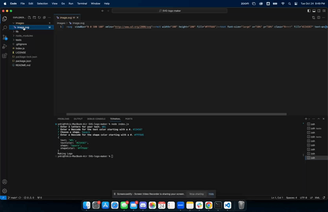

<div align="center">
  
  

  <h3 align="center">SVG LOGO MAKER</h3>

  <p align="center">
  This SVG logo maker is a command-line application built using JavaScript, Inquirer, and Jest. It empowers users to create custom SVG logos effortlessly. Whether you need a logo for your website, business, or personal project, this tool simplifies the design process.
  </p>
  
</div>


### Built With

[![React][React.js]][React-url]


<!-- GETTING STARTED -->
## Getting Started

Install the following to run SVG Logo Maker

### Prerequisites

Install <i>npm i inquirer</i>.
  ```sh
  npm i inquirer@8.2.4
  ```

Install <i>Jest.</i>
  ```sh
  npm install --save-dev jest
  ```

### Installation
1. Clone the repo
   ```sh
   git clone https://github.com/your_username_/Project-Name.git
   ```
2. Install NPM packages
   ```sh
   npm install
   ```
3. Run
    ```
    node index.js
    ```

<!-- LICENSE -->
## License

Distributed under the MIT License. See `LICENSE.txt` for more information.

<!-- CONTACT -->
## Contact

Nhi Hoang - [linkedin](https://www.linkedin.com/in/ynhihoang/)

Project Repo: [https://github.com/eviehoang/SVG-logo-maker](https://github.com/eviehoang/SVG-logo-maker)


<!-- ACKNOWLEDGMENTS -->
## Acknowledgments

* [GitHub Emoji Cheat Sheet](https://www.webpagefx.com/tools/emoji-cheat-sheet)
* [Ileriaya Markdown-badges](https://github.com/Ileriayo/markdown-badges)
* [GitHub Pages](https://pages.github.com)
* [W3School](https://w3schools.com/graphics/svg_rect.asp) for tutorial codes and educational references.
* [MDN](https://developer.mozilla.org/en-US/) for example codes and educational references.
